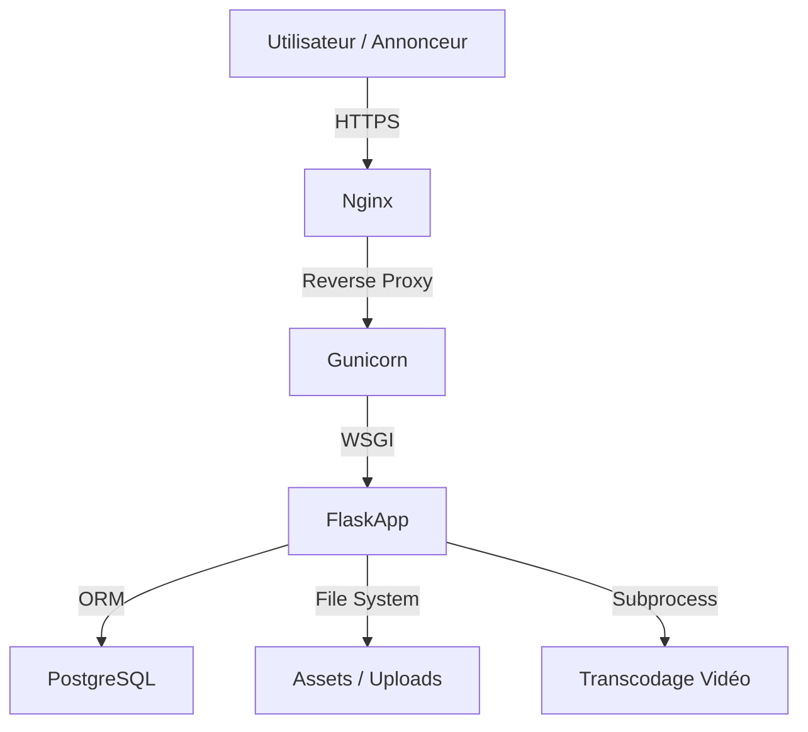

# Shabaka AdScreen 🚀


**La solution SaaS complète pour transformer n'importe quel écran en source de revenus.**
Shabaka AdScreen permet aux établissements (Hôtels, Restaurants, Malls) de gérer leur affichage dynamique et de vendre des espaces publicitaires en libre-service via QR Code.

---

## 📑 Table des Matières

- [Fonctionnalités Clés](#-fonctionnalités-clés)
- [Stack Technique](#-stack-technique)
- [Architecture](#-architecture)
- [Installation Rapide](#-installation-rapide)
- [Documentation Complète](#-documentation-complète)

---

## ✨ Fonctionnalités Clés

*   **📺 Player Universel** : Compatible Web, Android, Tizen. Supporte le mode Hors-ligne et le Streaming IPTV (HLS).
*   **💰 Booking Engine** : Réservation d'espaces publicitaires par QR Code. Paiement intégré, validation automatique des formats.
*   **📊 Dashboard Partenaire** : Gestion des écrans, validation des contenus, suivi des revenus en temps réel.
*   **🧾 Facturation Automatisée** : Génération hebdomadaire des factures et calcul des commissions plateforme.
*   **📱 API Mobile** : Une API RESTful sécurisée (JWT) pour le pilotage à distance via application mobile.

---

## 🛠 Stack Technique

Ce projet repose sur une architecture robuste et éprouvée :

*   **Backend** : Python 3.11, Flask, SQLAlchemy, Gunicorn (Gevent).
*   **Base de Données** : PostgreSQL (Prod), SQLite (Dev).
*   **Frontend** : Jinja2, Tailwind CSS 3.4, Vanilla JS.
*   **Traitement Média** : FFmpeg (Streaming/HLS), Pillow (Images).
*   **Sécurité** : CSRF Protection, Rate Limiting, Input Sanitization.

---

## 🏗 Architecture

Le système suit une architecture **Monolithique Modulaire** (MVC) :



---

## 🚀 Installation Rapide

### Prérequis
*   Python 3.11+
*   PostgreSQL
*   FFmpeg

### Démarrage Local

1.  **Cloner le dépôt**
    ```bash
    git clone https://github.com/votre-org/shabaka-adscreen.git
    cd shabaka-adscreen
    ```

2.  **Installer les dépendances**
    ```bash
    python3 -m venv venv
    source venv/bin/activate
    pip install -r requirements.txt
    ```

3.  **Configurer l'environnement**
    ```bash
    export FLASK_ENV=development
    export SESSION_SECRET="dev-secret"
    export DATABASE_URL="sqlite:///shabaka.db" # Ou PostgreSQL
    ```

4.  **Initialiser la Base de Données**
    ```bash
    python init_db.py       # Création des tables
    python init_db_demo.py  # (Optionnel) Données de test
    ```

5.  **Lancer le serveur**
    ```bash
    python main.py
    ```
    Accédez à `http://localhost:5000`

---

## 📚 Documentation Complète

Toute la documentation technique et fonctionnelle se trouve dans le dossier `docs/`.

| Document | Description | Cible |
| :--- | :--- | :--- |
| [**Fonctionnalités Détaillées**](docs/Shabaka_AdScreen_Fonctionnalites_Detaillees.md) | La "Bible" du projet. Tout ce que le système fait. | Tout le monde |
| [**Architecture Technique**](docs/Shabaka_AdScreen_Architecture_Technique.md) | Stack, Blueprints, HLS, Flux de données. | Développeurs |
| [**Schéma de Base de Données**](docs/Shabaka_AdScreen_Schema_Base_De_Donnees.md) | Modèles, relations et champs clés. | Développeurs |
| [**Guide de Déploiement**](docs/Shabaka_AdScreen_Guide_Deploiement.md) | Installation VPS, Nginx, Systemd, SSL. | DevOps |
| [**Référence API**](docs/Shabaka_AdScreen_Reference_API.md) | Endpoints Mobile (JWT) et Player (Session). | Développeurs Mobile/Web |
| [**Audit de Sécurité**](docs/Shabaka_AdScreen_Audit_Securite.md) | Mesures de protection (CSRF, Rate Limit...). | RSSI / Auditeurs |
| [**Manuel Utilisateur**](docs/Shabaka_AdScreen_Manuel_Utilisateur.md) | Guide pour les Organisations et Annonceurs. | Utilisateurs Finaux |

---

<p align="center">
  Fait avec ❤️ par l'équipe technique Shabaka AdScreen.
</p>
