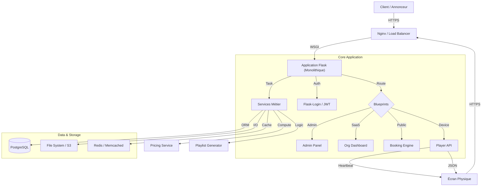

     

[ 🇫🇷 Français ] | [ 🇬🇧 English ](README_en.md)

# SHABAKA ADSCREEN

> **ATTENTION :** Ce projet est un logiciel **PROPRIÉTAIRE** et **PRIVÉ**.
> **Propriétaire :** MOA Digital Agency (myoneart.com)
> **Auteur :** Aisance KALONJI
> **Licence :** Usage interne strict. Toute reproduction ou distribution interdite.

---

## Description
**Shabaka AdScreen** est une plateforme SaaS complète de gestion d'affichage dynamique (Digital Signage). Elle orchestre un réseau d'écrans connectés, gère la vente d'espaces publicitaires via un algorithme de pricing dynamique, et assure la diffusion fluide des contenus médias (Vidéos, Images).

## Architecture Technique


```mermaid
graph TD
    Client[Client / Annonceur] -->|HTTPS| Proxy[Nginx / Load Balancer]
    Screen[Écran Physique] -->|HTTPS| Proxy

    Proxy -->|WSGI| App["Application Flask (Monolithique)"]

    subgraph "Core Application"
        App -->|Route| Blueprints{Blueprints}
        Blueprints -->|Admin| AdminBP[Admin Panel]
        Blueprints -->|SaaS| OrgBP[Org Dashboard]
        Blueprints -->|Public| BookingBP[Booking Engine]
        Blueprints -->|Device| PlayerBP[Player API]

        App -->|Auth| Security[Flask-Login / JWT]
        App -->|Task| Services[Services Métier]
    end

    subgraph "Data & Storage"
        Services -->|ORM| DB[(PostgreSQL)]
        Services -->|I/O| Storage[File System / S3]
        Services -->|Cache| Cache[Redis / Memcached]
    end

    Services -->|Compute| Pricing[Pricing Service]
    Services -->|Logic| Playlist[Playlist Generator]

    PlayerBP -->|Heartbeat| Screen
    PlayerBP -->|JSON| Screen
```

## Table des Matières
1.  [Fonctionnalités Clés](#fonctionnalités-clés)
2.  [Installation & Démarrage](#installation--démarrage)
3.  [Documentation](#documentation)

## Fonctionnalités Clés
*   **Gestion Multi-Tenants :** Organisations autonomes avec leurs propres écrans.
*   **Pricing Dynamique :** Algorithme basé sur la durée, la période (Heure pleine/creuse) et la popularité de l'écran.
*   **Player Intelligent :** Mise en cache locale, file de priorité (Urgence > Payant > Interne), et fonctionnement hors-ligne.
*   **Facturation Automatisée :** Génération de factures, calcul de commissions, et preuves de diffusion.

## Installation & Démarrage

### Prérequis
*   Python 3.11+
*   PostgreSQL (ou SQLite pour dev)
*   FFmpeg (pour le traitement vidéo)

### Commandes
```bash
# 1. Cloner le dépôt (Interne uniquement)
git clone <repo_url>

# 2. Installer les dépendances
pip install -r requirements.txt

# 3. Initialiser la base de données
python init_db.py

# 4. Lancer le serveur de développement
python main.py
```

## Documentation
Pour une compréhension approfondie du système, référez-vous aux documents officiels (en français et anglais) dans le dossier `docs/`. Ce fichier `README.md` est le point d'entrée principal.

*   📖 **[Bible des Fonctionnalités](docs/Shabaka_AdScreen_features_full_list.md)** : Liste exhaustive des règles métier et algorithmes.
*   ⚙️ **[Manuel Technique](docs/Shabaka_AdScreen_Technical_Manual.md)** : Stack, Architecture, Haute Disponibilité, Sécurité.
*   🎓 **[Guide Utilisateur](docs/Shabaka_AdScreen_User_Guide.md)** : Tutoriels pour Admins et Clients.
