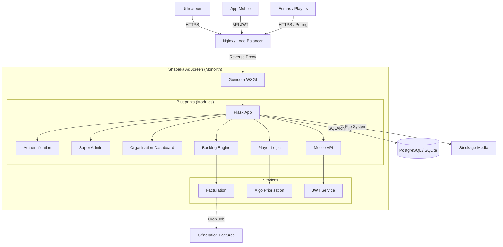

**© MOA Digital Agency (myoneart.com) - Auteur : Aisance KALONJI**
*Ce code est la propriété exclusive de MOA Digital Agency. Usage interne uniquement. Toute reproduction ou distribution non autorisée est strictement interdite.*

[Switch to English Version](./README_en.md)

---


# Shabaka AdScreen

**La solution de Digital Signage "Enterprise-Grade" pour la gestion de flottes d'écrans publicitaires et l'optimisation des revenus.**

Shabaka AdScreen est une plateforme centralisée permettant aux établissements (hôtels, restaurants, malls) de monétiser leurs écrans via la publicité. Elle offre une interface de gestion complète pour les propriétaires d'écrans, un tunnel de réservation pour les annonceurs, et un player web robuste capable de diffuser du contenu multimédia et des flux IPTV.

---

### 🏛️ Architecture du Système


```mermaid
graph TD
    User[Utilisateurs] -->|HTTPS| LB[Nginx / Load Balancer]
    Mobile[App Mobile] -->|API JWT| LB
    Screen[Écrans / Players] -->|HTTPS / Polling| LB

    LB -->|Reverse Proxy| Gunicorn[Gunicorn WSGI]

    subgraph "Shabaka AdScreen (Monolith)"
        Gunicorn --> Flask[Flask App]

        subgraph "Blueprints (Modules)"
            Flask --> Auth[Authentification]
            Flask --> Admin[Super Admin]
            Flask --> Org[Organisation Dashboard]
            Flask --> Booking[Booking Engine]
            Flask --> Player[Player Logic]
            Flask --> API[Mobile API]
        end

        subgraph "Services"
            Booking --> BillingService[Facturation]
            Player --> PlaylistAlgo[Algo Priorisation]
            API --> AuthJWT[JWT Service]
        end
    end

    Flask -->|SQLAlchemy| DB[(PostgreSQL / SQLite)]
    Flask -->|File System| Storage[Stockage Média]

    BillingService -.->|Cron Job| Invoices[Génération Factures]
```

---

### ⚠️ AVERTISSEMENT LÉGAL (LEGAL NOTICE)

> **CE LOGICIEL EST LA PROPRIÉTÉ EXCLUSIVE DE MOA DIGITAL AGENCY (Aisance KALONJI).**
>
> Tout usage, copie, modification, distribution ou vente de ce code source sans autorisation écrite explicite est **STRICTEMENT INTERDIT** et fera l'objet de poursuites judiciaires immédiates.
> Ce dépôt est destiné uniquement à un usage interne pour la sauvegarde et le déploiement sur les infrastructures autorisées par MOA Digital Agency.

---

### 🚀 Installation & Démarrage

#### Prérequis
*   Python 3.11 ou supérieur
*   `pip` et `virtualenv`
*   PostgreSQL (Production) ou SQLite (Dev)

#### Déploiement Local

1.  **Cloner le dépôt :**
    ```bash
    git clone <url_du_repo>
    cd shabaka-adscreen
    ```

2.  **Créer l'environnement virtuel :**
    ```bash
    python -m venv venv
    source venv/bin/activate  # Sur Windows: venv\Scripts\activate
    ```

3.  **Installer les dépendances :**
    ```bash
    pip install -r requirements.txt
    ```

4.  **Configuration :**
    Créer un fichier `.env` à la racine :
    ```bash
    export FLASK_APP=app.py
    export FLASK_ENV=development
    export SESSION_SECRET="votre_secret_tres_long"
    export DATABASE_URL="sqlite:///shabaka.db"
    ```

5.  **Initialiser la Base de Données :**
    ```bash
    python init_db.py
    ```

6.  **Lancer le serveur :**
    ```bash
    python main.py
    # Ou via Gunicorn :
    # gunicorn -k gevent -w 4 -b 0.0.0.0:8080 app:app
    ```

---

### 📚 Index de la Documentation

La documentation complète et détaillée est disponible dans le dossier `docs/` :

1.  **La Bible des Fonctionnalités :**
    *   [Français](./docs/Shabaka_AdScreen_features_full_list.md) - Liste exhaustive des règles métier.
    *   [English](./docs/Shabaka_AdScreen_features_full_list_en.md) - Comprehensive feature list.

2.  **Manuel Technique :**
    *   [Français](./docs/Shabaka_AdScreen_Technical_Manual.md) - Architecture, Sécurité, Déploiement.
    *   [English](./docs/Shabaka_AdScreen_Technical_Manual_en.md) - Architecture, Security, Deployment.

3.  **Guide Utilisateur :**
    *   [Français](./docs/Shabaka_AdScreen_User_Guide.md) - Pour les Propriétaires et Annonceurs.
    *   [English](./docs/Shabaka_AdScreen_User_Guide_en.md) - For Owners and Advertisers.
