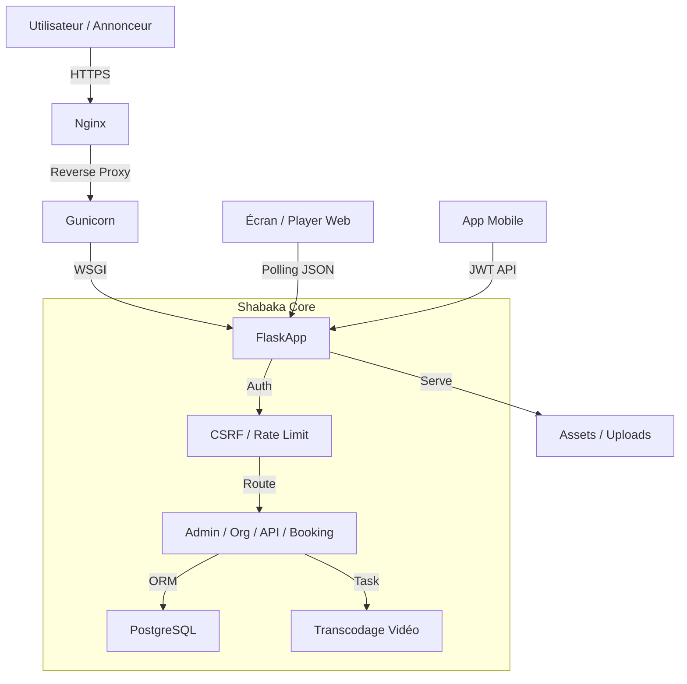

# Shabaka AdScreen 🚀


**Produit de : MOA Digital Agency LLC (myoneart.com)**
**Auteur : Aisance KALONJI**

---

### ⚠️ AVERTISSEMENT LÉGAL - PROPRIÉTÉ PRIVÉE

**Copyright © 2024 MOA Digital Agency LLC (myoneart.com). Auteur : Aisance KALONJI. Tous droits réservés.**

Ce code source est la propriété exclusive de **MOA Digital Agency LLC**. Toute copie, distribution, modification, réutilisation totale ou partielle, ou ingénierie inverse est **STRICTEMENT INTERDITE** et fera l'objet de poursuites judiciaires immédiates.
L'accès à ce dépôt ne confère aucun droit d'utilisation commerciale ou personnelle sans une licence écrite et signée par les ayants droit.

---

## 💡 Le Pitch

**Shabaka AdScreen** est la solution SaaS ultime pour transformer n'importe quel écran en source de revenus autonome.
Nous permettons aux établissements (Hôtels, Malls, Restaurants) de piloter leur affichage dynamique et de **vendre des espaces publicitaires en libre-service** via un simple QR Code.

*   **Monétisation Automatique :** Vos écrans génèrent du cash pendant que vous dormez.
*   **Contrôle Total :** Validation des pubs, gestion des playlists, et facturation automatisée.
*   **Universel :** Compatible Web, Smart TV (Tizen/WebOS), Android et boîtiers IPTV.

---

## 🏗 Architecture

Le système repose sur une architecture **Monolithique Modulaire** robuste, conçue pour la performance et la sécurité.


```mermaid
graph TD
    User[Utilisateur / Annonceur] -->|HTTPS| Nginx
    Nginx -->|Reverse Proxy| Gunicorn
    Gunicorn -->|WSGI| FlaskApp

    subgraph "Shabaka Core"
        FlaskApp -->|Auth| Security[CSRF / Rate Limit]
        Security -->|Route| Blueprints[Admin / Org / API / Booking]
        Blueprints -->|ORM| PostgreSQL
        Blueprints -->|Task| FFmpeg[Transcodage Vidéo]
    end

    FlaskApp -->|Serve| StaticFiles[Assets / Uploads]
    Player[Écran / Player Web] -->|Polling JSON| FlaskApp
    MobileApp[App Mobile] -->|JWT API| FlaskApp
```

---

## 📑 Table des Matières

1.  [Stack Technique](#-stack-technique)
2.  [Installation & Démarrage](#-installation--démarrage)
3.  [Documentation Complète](#-documentation-complète)

---

## 🛠 Stack Technique

*   **Backend :** Python 3.11, Flask, SQLAlchemy, Gunicorn.
*   **Base de Données :** PostgreSQL (Prod), SQLite (Dev).
*   **Frontend :** Jinja2, Tailwind CSS 3.4, Vanilla JS.
*   **Média :** FFmpeg (HLS/Streaming), Pillow.
*   **Sécurité :** Flask-Login, PyJWT, Bleach, CSRF Protection manuelle.

---

## 🚀 Installation & Démarrage

### Prérequis
*   Python 3.11+
*   PostgreSQL
*   FFmpeg

### Commandes

```bash
# 1. Cloner (Usage privé uniquement)
git clone https://github.com/moa-digital/shabaka-adscreen.git
cd shabaka-adscreen

# 2. Environnement Virtuel
python3 -m venv venv
source venv/bin/activate

# 3. Dépendances
pip install -r requirements.txt

# 4. Configuration
export FLASK_ENV=development
export DATABASE_URL="sqlite:///shabaka.db"
export SESSION_SECRET="votre_secret_key"

# 5. Base de Données
python init_db.py

# 6. Lancer
python main.py
```

Accédez à `http://localhost:5000`.

---

## 📚 Documentation Complète

L'ensemble de la documentation technique et fonctionnelle se trouve dans le dossier `docs/`.

| Document | Description |
| :--- | :--- |
| [**Fonctionnalités & Bible (Features List)**](docs/Shabaka_AdScreen_features_full_list.md) | **LA RÉFÉRENCE.** Détail exhaustif des règles métier. |
| [**Architecture Technique**](docs/Shabaka_AdScreen_Architecture_Technique.md) | Structure du code, flux de données et sécurité. |
| [**Référence API**](docs/Shabaka_AdScreen_Reference_API.md) | Endpoints Player et Mobile (JWT). |
| [**Schéma Base de Données**](docs/Shabaka_AdScreen_Schema_Base_De_Donnees.md) | Modèle de données relationnel. |
| [**Guide de Déploiement**](docs/Shabaka_AdScreen_Guide_Deploiement.md) | Mise en production sur VPS. |
| [**Manuel Utilisateur**](docs/Shabaka_AdScreen_Manuel_Utilisateur.md) | Guide d'utilisation pour les clients. |
| [**Audit de Sécurité**](docs/Shabaka_AdScreen_Audit_Securite.md) | Rapport des mesures de sécurité implémentées. |

---

<p align="center">
  <b>PROPRIÉTÉ EXCLUSIVE DE MOA DIGITAL AGENCY LLC.</b><br>
  Toute infraction sera poursuivie.
</p>
