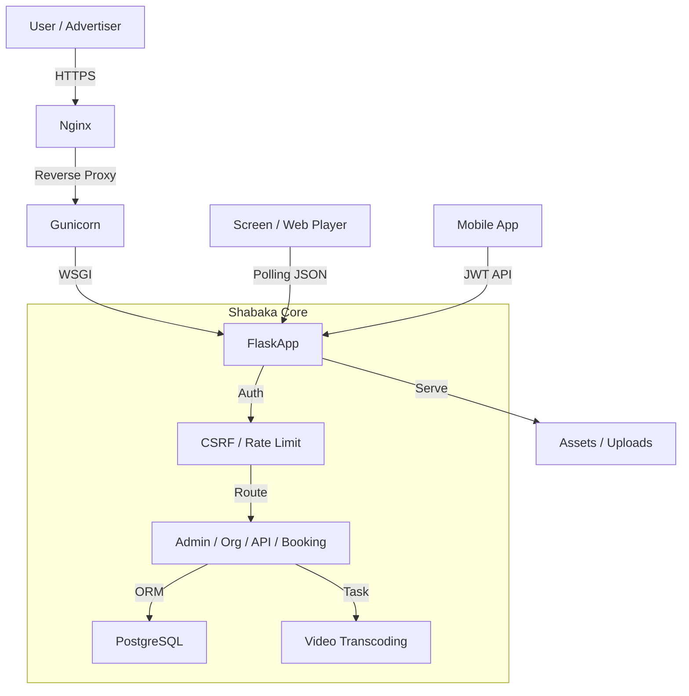

     

# Shabaka AdScreen 🚀

**Product of: MOA Digital Agency LLC (myoneart.com)**
**Author: Aisance KALONJI**

> **⚠️ LEGAL WARNING - PRIVATE PROPERTY / AVERTISSEMENT LÉGAL - PROPRIÉTÉ PRIVÉE**
>
> **Copyright © 2024 MOA Digital Agency LLC (myoneart.com). Author: Aisance KALONJI. All rights reserved.**
>
> This source code is the **exclusive property** of MOA Digital Agency LLC. Any copy, distribution, modification, total or partial reuse, or reverse engineering is **STRICTLY PROHIBITED** and will result in immediate legal action. Access to this repository does not confer any commercial or personal usage rights without a written license signed by the rights holders.
>
> ---
>
> Ce code source est la **propriété exclusive** de MOA Digital Agency LLC. Toute copie, distribution, modification, réutilisation totale ou partielle, ou ingénierie inverse est **STRICTEMENT INTERDITE** et fera l'objet de poursuites judiciaires immédiates. L'accès à ce dépôt ne confère aucun droit d'utilisation commerciale ou personnelle sans une licence écrite et signée par les ayants droit.

---

## 💡 Pitch

### 🇬🇧 English
**Shabaka AdScreen** is the ultimate SaaS solution to transform any screen into an autonomous revenue source. We enable venues (Hotels, Malls, Restaurants) to manage their digital signage and **sell advertising slots self-service** via a simple QR Code.
*   **Auto-Monetization**: Your screens generate cash while you sleep.
*   **Total Control**: Ad validation, playlist management, and automated billing.
*   **Universal**: Compatible with Web, Smart TV (Tizen/WebOS), Android, and IPTV boxes.

### 🇫🇷 Français
**Shabaka AdScreen** est la solution SaaS ultime pour transformer n'importe quel écran en source de revenus autonome. Nous permettons aux établissements (Hôtels, Malls, Restaurants) de piloter leur affichage dynamique et de **vendre des espaces publicitaires en libre-service** via un simple QR Code.
*   **Monétisation Automatique :** Vos écrans génèrent du cash pendant que vous dormez.
*   **Contrôle Total :** Validation des pubs, gestion des playlists, et facturation automatisée.
*   **Universel :** Compatible Web, Smart TV (Tizen/WebOS), Android et boîtiers IPTV.

---

## 🏗 Architecture

The system relies on a robust **Monolithic Modular** architecture, designed for performance and security.
Le système repose sur une architecture **Monolithique Modulaire** robuste, conçue pour la performance et la sécurité.


```mermaid
graph TD
    User[User / Advertiser] -->|HTTPS| Nginx
    Nginx -->|Reverse Proxy| Gunicorn
    Gunicorn -->|WSGI| FlaskApp

    subgraph "Shabaka Core"
        FlaskApp -->|Auth| Security[CSRF / Rate Limit]
        Security -->|Route| Blueprints[Admin / Org / API / Booking]
        Blueprints -->|ORM| PostgreSQL
        Blueprints -->|Task| FFmpeg[Video Transcoding]
    end

    FlaskApp -->|Serve| StaticFiles[Assets / Uploads]
    Player[Screen / Web Player] -->|Polling JSON| FlaskApp
    MobileApp[Mobile App] -->|JWT API| FlaskApp
```

---

## 📑 Table of Contents / Table des Matières

1.  [Documentation](#-documentation)
2.  [Installation & Start / Installation & Démarrage](#-installation--start--installation--démarrage)
3.  [Tech Stack / Stack Technique](#-tech-stack--stack-technique)

---

## 📚 Documentation

Detailed documentation is available in the `docs/` folder.
La documentation détaillée est disponible dans le dossier `docs/`.

| Document | Description (EN) | Description (FR) |
| :--- | :--- | :--- |
| [**Features List (The Bible)**](docs/Shabaka_AdScreen_features_full_list.md) | **THE REFERENCE.** Exhaustive list of business rules. | **LA RÉFÉRENCE.** Détail exhaustif des règles métier. |
| [**Technical Manual**](docs/Shabaka_AdScreen_Technical_Manual.md) | Architecture, Security, Database, API, Deployment. | Architecture, Sécurité, BDD, API, Déploiement. |
| [**User Guide**](docs/Shabaka_AdScreen_User_Guide.md) | User manual for Venues and Advertisers. | Manuel utilisateur pour Lieux et Annonceurs. |

---

## 🚀 Installation & Start / Installation & Démarrage

### Prerequisites / Prérequis
*   Python 3.11+
*   PostgreSQL
*   FFmpeg

### Commands / Commandes

```bash
# 1. Clone (Private usage only / Usage privé uniquement)
git clone https://github.com/moa-digital/shabaka-adscreen.git
cd shabaka-adscreen

# 2. Virtual Env / Environnement Virtuel
python3 -m venv venv
source venv/bin/activate

# 3. Dependencies / Dépendances
pip install -r requirements.txt

# 4. Config
export FLASK_ENV=development
export DATABASE_URL="sqlite:///shabaka.db"
export SESSION_SECRET="your_secret_key"

# 5. Database / Base de Données
python init_db.py

# 6. Run / Lancer
python main.py
```

Access: `http://localhost:5000`

---

## 🛠 Tech Stack / Stack Technique

*   **Backend:** Python 3.11, Flask, SQLAlchemy, Gunicorn.
*   **Database:** PostgreSQL (Prod), SQLite (Dev).
*   **Frontend:** Jinja2, Tailwind CSS 3.4, Vanilla JS.
*   **Media:** FFmpeg (HLS/Streaming), Pillow.
*   **Security:** Flask-Login, PyJWT, Bleach, Manual CSRF Protection.

---

<p align="center">
  <b>PROPRIETARY PROPERTY OF MOA DIGITAL AGENCY LLC.</b><br>
  <b>PROPRIÉTÉ EXCLUSIVE DE MOA DIGITAL AGENCY LLC.</b><br>
  Any infringement will be prosecuted. / Toute infraction sera poursuivie.
</p>
