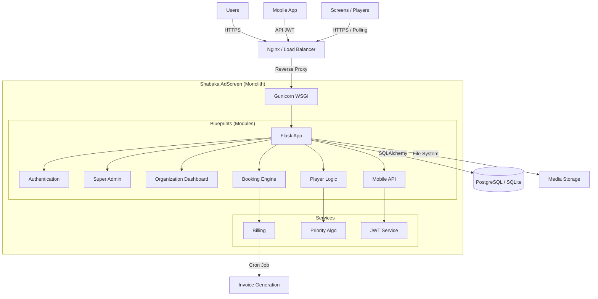

**© MOA Digital Agency (myoneart.com) - Author: Aisance KALONJI**
*This code is the exclusive property of MOA Digital Agency. Internal use only. Unauthorized reproduction or distribution is strictly prohibited.*

[Passer à la version Française](./README.md)

---


# Shabaka AdScreen

**The "Enterprise-Grade" Digital Signage solution for managing advertising screen fleets and optimizing revenue.**

Shabaka AdScreen is a centralized platform allowing venues (hotels, restaurants, malls) to monetize their screens via advertising. It offers a complete management interface for screen owners, a booking funnel for advertisers, and a robust web player capable of broadcasting multimedia content and IPTV streams.

---

### 🏛️ System Architecture



---

### ⚠️ LEGAL NOTICE

> **THIS SOFTWARE IS THE EXCLUSIVE PROPERTY OF MOA DIGITAL AGENCY (Aisance KALONJI).**
>
> Any use, copying, modification, distribution, or sale of this source code without explicit written authorization is **STRICTLY PROHIBITED** and will result in immediate legal action.
> This repository is intended solely for internal use for backup and deployment on infrastructures authorized by MOA Digital Agency.

---

### 🚀 Installation & Startup

#### Prerequisites
*   Python 3.11 or higher
*   `pip` and `virtualenv`
*   PostgreSQL (Production) or SQLite (Dev)

#### Local Deployment

1.  **Clone the repository:**
    ```bash
    git clone <repo_url>
    cd shabaka-adscreen
    ```

2.  **Create the virtual environment:**
    ```bash
    python -m venv venv
    source venv/bin/activate  # On Windows: venv\Scripts\activate
    ```

3.  **Install dependencies:**
    ```bash
    pip install -r requirements.txt
    ```

4.  **Configuration:**
    Create a `.env` file at the root:
    ```bash
    export FLASK_APP=app.py
    export FLASK_ENV=development
    export SESSION_SECRET="your_very_long_secret"
    export DATABASE_URL="sqlite:///shabaka.db"
    ```

5.  **Initialize the Database:**
    ```bash
    python init_db.py
    ```

6.  **Start the server:**
    ```bash
    python main.py
    # Or via Gunicorn:
    # gunicorn -k gevent -w 4 -b 0.0.0.0:8080 app:app
    ```

---

### 📚 Documentation Index

Comprehensive and detailed documentation is available in the `docs/` folder:

1.  **The Features Bible:**
    *   [Français](./docs/Shabaka_AdScreen_features_full_list.md) - Liste exhaustive des règles métier.
    *   [English](./docs/Shabaka_AdScreen_features_full_list_en.md) - Comprehensive feature list.

2.  **Technical Manual:**
    *   [Français](./docs/Shabaka_AdScreen_Technical_Manual.md) - Architecture, Sécurité, Déploiement.
    *   [English](./docs/Shabaka_AdScreen_Technical_Manual_en.md) - Architecture, Security, Deployment.

3.  **User Guide:**
    *   [Français](./docs/Shabaka_AdScreen_User_Guide.md) - Pour les Propriétaires et Annonceurs.
    *   [English](./docs/Shabaka_AdScreen_User_Guide_en.md) - For Owners and Advertisers.
