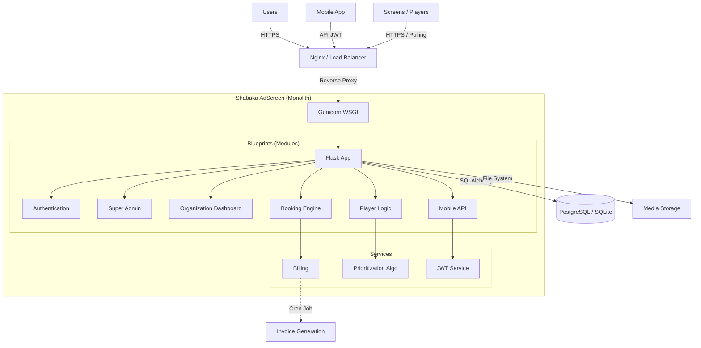

     

# Shabaka AdScreen

**The "Enterprise-Grade" Digital Signage solution for managing fleets of advertising screens and maximizing revenue.**

---

### ⚠️ LEGAL NOTICE

**THIS SOFTWARE IS THE EXCLUSIVE PROPERTY OF MOA DIGITAL AGENCY (Aisance KALONJI).**

Any unauthorized use, copying, modification, distribution, or sale of this source code is **STRICTLY PROHIBITED** and will result in immediate legal action.
This repository is intended solely for internal use, backup, and deployment on infrastructure authorized by MOA Digital Agency.

---

## 🏛️ System Architecture



## 📑 Table of Contents

1.  [Description](#description)
2.  [Tech Stack](#-tech-stack)
3.  [Installation & Start](#-installation--start)
4.  [Documentation](#-documentation)
5.  [License](#-license)

## 📝 Description

Shabaka AdScreen is a centralized platform allowing venues (hotels, restaurants, malls) to monetize their screens via advertising. It offers a complete management interface for screen owners, a booking tunnel for advertisers, and a robust web player capable of broadcasting multimedia content and IPTV streams.

## 💻 Tech Stack

*   **Language:** Python 3.11+
*   **Web Framework:** Flask 3.0+
*   **Application Server:** Gunicorn (with Gevent Workers)
*   **Database:** PostgreSQL (Prod) / SQLite (Dev)
*   **Frontend:** Jinja2, Tailwind CSS, Vanilla JS
*   **Video/Streaming:** FFmpeg, HLS.js
*   **Security:** Flask-Login, PyJWT, Werkzeug Security, Bleach

## 🚀 Installation & Start

### Requirements
*   Python 3.11 or higher
*   `pip` and `virtualenv`

### Local Deployment

1.  **Clone the repository:**
    ```bash
    git clone <repo_url>
    cd shabaka-adscreen
    ```

2.  **Create virtual environment:**
    ```bash
    python -m venv venv
    source venv/bin/activate  # On Windows: venv\Scripts\activate
    ```

3.  **Install dependencies:**
    ```bash
    pip install -r requirements.txt
    ```

4.  **Configuration:**
    Create a `.env` file or set environment variables:
    ```bash
    export FLASK_APP=app.py
    export FLASK_ENV=development
    export SESSION_SECRET="your_very_long_secret"
    export DATABASE_URL="sqlite:///shabaka.db"
    ```

5.  **Initialize Database:**
    ```bash
    python init_db.py
    ```

6.  **Start the server:**
    ```bash
    python main.py
    # Or via Gunicorn:
    # gunicorn -k gevent -w 4 -b 0.0.0.0:8080 app:app
    ```

## 📚 Documentation

Complete documentation is available in the `docs/` folder:

*   **Features Bible:** [docs/Shabaka_AdScreen_features_full_list_en.md](docs/Shabaka_AdScreen_features_full_list_en.md)
*   **Technical Manual:** [docs/Shabaka_AdScreen_Technical_Manual_en.md](docs/Shabaka_AdScreen_Technical_Manual_en.md)
*   **User Guide:** [docs/Shabaka_AdScreen_User_Guide_en.md](docs/Shabaka_AdScreen_User_Guide_en.md)

*(Versions françaises disponibles sans suffixe `_en.md`)*

## 🔒 License

This project is under **Proprietary** license. See the [LICENSE](LICENSE) file for more details.
Copyright © 2024 MOA Digital Agency.
